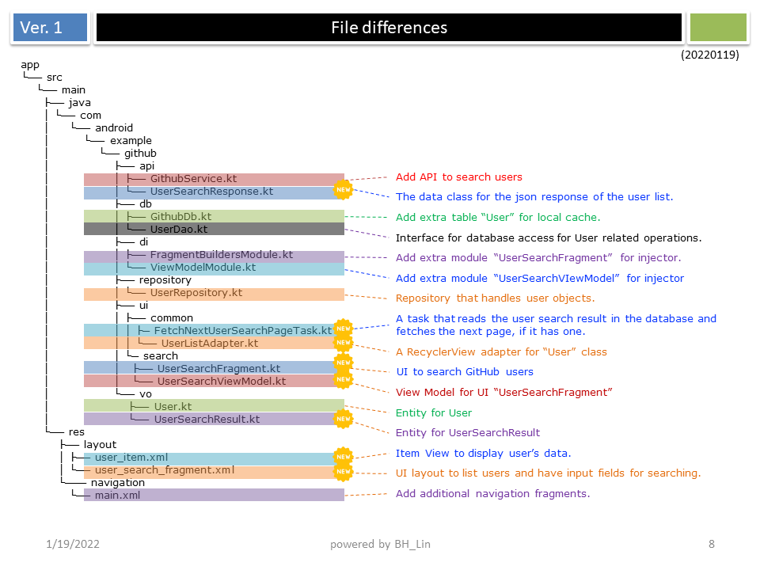
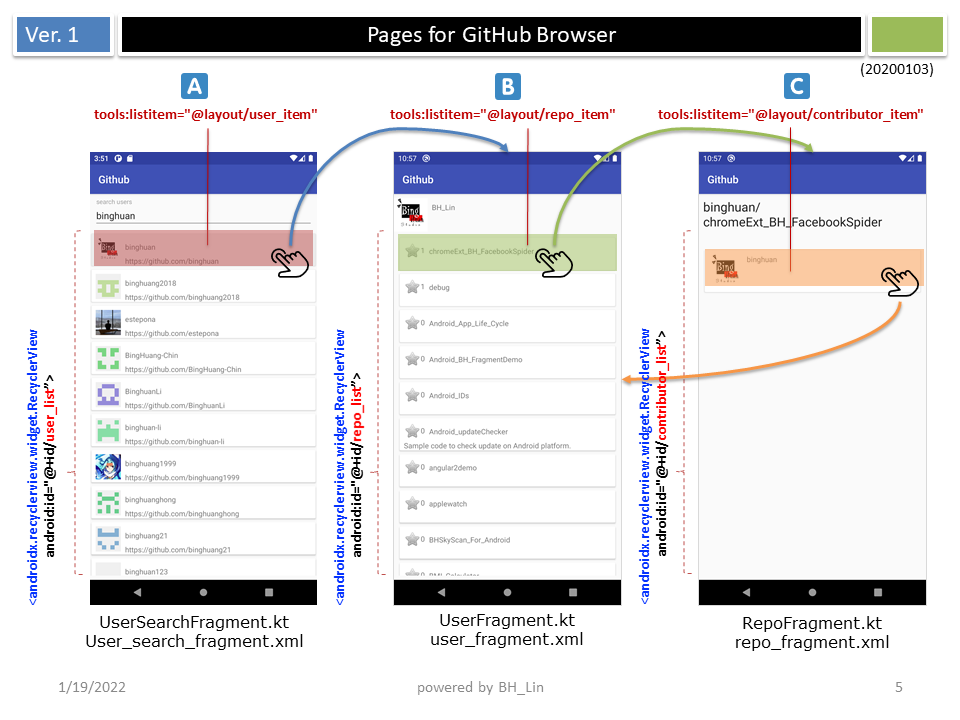
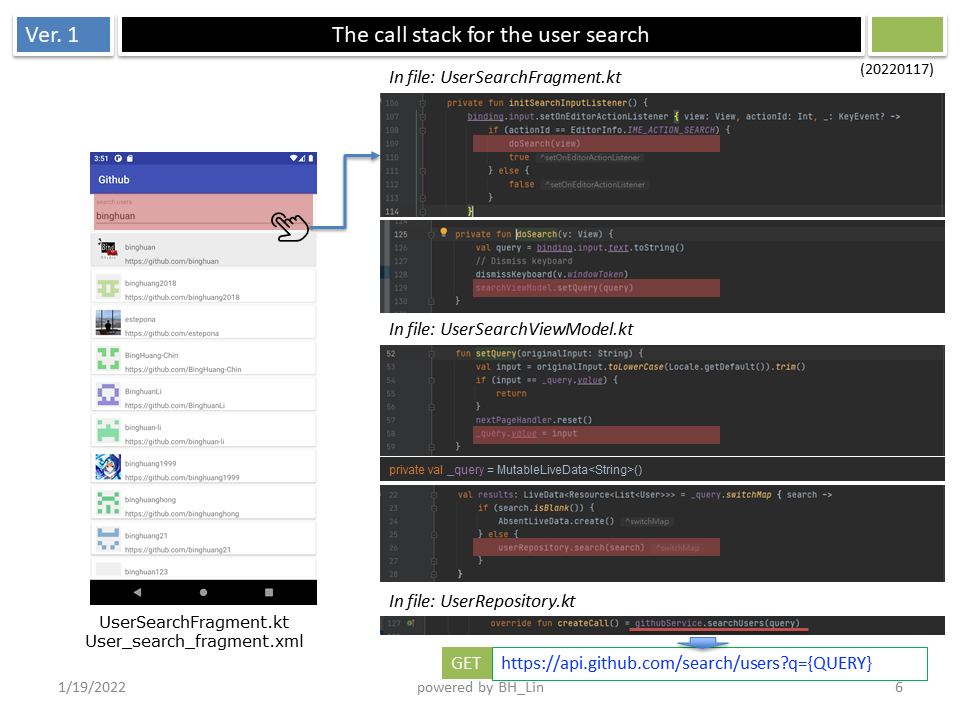
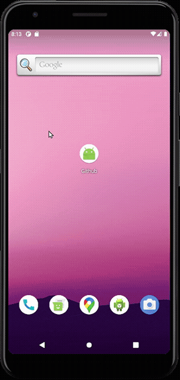
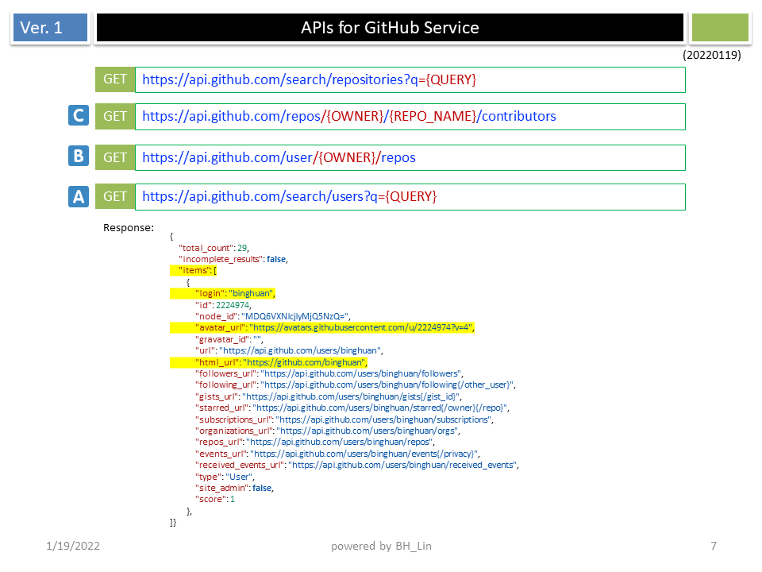

Github Browser Sample with Android Architecture Components
===========================================================

This app is based on sample app that uses Android Architecture Components with Dagger 2.  
Here is the file diff:  

## Table of Contents
<!-- START doctoc generated TOC please keep comment here to allow auto update -->
<!-- DON'T EDIT THIS SECTION, INSTEAD RE-RUN doctoc TO UPDATE -->
- [Github Browser Sample with Android Architecture Components](#github-browser-sample-with-android-architecture-components)
  - [Table of Contents](#table-of-contents)
  - [Introduction](#introduction)
    - [Functionality](#functionality)
      - [UserSearchFragment](#usersearchfragment)
      - [RepoFragment](#repofragment)
      - [UserFragment](#userfragment)
    - [Building](#building)
    - [Demo](#demo)
    - [GitHub Service APIs](#github-service-apis)
    - [Testing](#testing)
      - [Device Tests](#device-tests)
        - [Database Tests](#database-tests)
      - [Local Unit Tests](#local-unit-tests)
        - [ViewModel Tests](#viewmodel-tests)
        - [Repository Tests](#repository-tests)
        - [Webservice Tests](#webservice-tests)
    - [Libraries](#libraries)
  - [License](#license)
<!-- END doctoc generated TOC please keep comment here to allow auto update -->

Introduction
-------------

### Functionality
The app is composed of 3 main screens.  

#### UserSearchFragment  
- Allows you to search users on Github.  
- Each search result is kept in the database in `UserSearchResult` table where
the list of repository IDs are denormalized into a single column.  
- The actual `User` instances live in the `User` table.  
- Each time a new page is fetched, the same `UserSearchResult` record in the
Database is updated with the new list of user ids. 
 (***NOTE*** The UI currently loads all `User` items at once, which would not
perform well on lower end devices. Instead of manually writing lazy
adapters, we've decided to wait until the built in support in Room is released.)

#### RepoFragment 
- This fragment displays the details of a repository and its contributors.  

#### UserFragment
- This fragment displays a user and their repositories.  

### Building
You can open the project in Android studio and press run.

### Demo

### GitHub Service APIs

### Testing
The project uses both instrumentation tests that run on the device
and local unit tests that run on your computer.

#### Device Tests
##### Database Tests
The project creates an in memory database for each database test but still
runs them on the device.

#### Local Unit Tests
##### ViewModel Tests
Each ViewModel is tested using local unit tests with mock Repository
implementations.
##### Repository Tests
Each Repository is tested using local unit tests with mock web service and
mock database.
##### Webservice Tests
The project uses [MockWebServer][mockwebserver] project to test REST api interactions.

### Libraries
* [Android Support Library][support-lib]
* [Android Architecture Components][arch]
* [Android Data Binding][data-binding]
* [Dagger 2][dagger2] for dependency injection
* [Retrofit][retrofit] for REST api communication
* [Glide][glide] for image loading
* [Timber][timber] for logging
* [espresso][espresso] for UI tests
* [mockito][mockito] for mocking in tests

[mockwebserver]: https://github.com/square/okhttp/tree/master/mockwebserver
[support-lib]: https://developer.android.com/topic/libraries/support-library/index.html
[arch]: https://developer.android.com/arch
[data-binding]: https://developer.android.com/topic/libraries/data-binding/index.html
[espresso]: https://google.github.io/android-testing-support-library/docs/espresso/
[dagger2]: https://google.github.io/dagger
[retrofit]: http://square.github.io/retrofit
[glide]: https://github.com/bumptech/glide
[timber]: https://github.com/JakeWharton/timber
[mockito]: http://site.mockito.org

License
--------

Copyright 2017 The Android Open Source Project, Inc.

Licensed to the Apache Software Foundation (ASF) under one or more contributor
license agreements.  See the NOTICE file distributed with this work for
additional information regarding copyright ownership.  The ASF licenses this
file to you under the Apache License, Version 2.0 (the "License"); you may not
use this file except in compliance with the License.  You may obtain a copy of
the License at

http://www.apache.org/licenses/LICENSE-2.0

Unless required by applicable law or agreed to in writing, software
distributed under the License is distributed on an "AS IS" BASIS, WITHOUT
WARRANTIES OR CONDITIONS OF ANY KIND, either express or implied.  See the
License for the specific language governing permissions and limitations under
the License.
